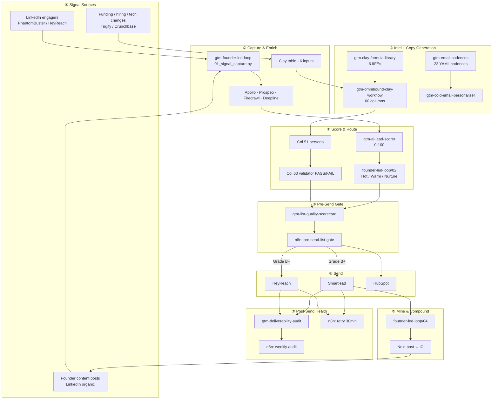
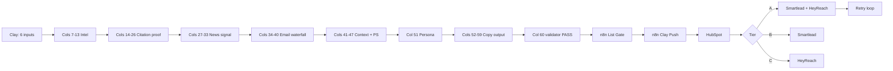
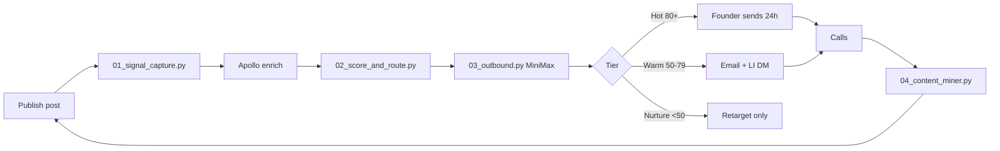
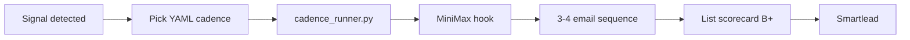
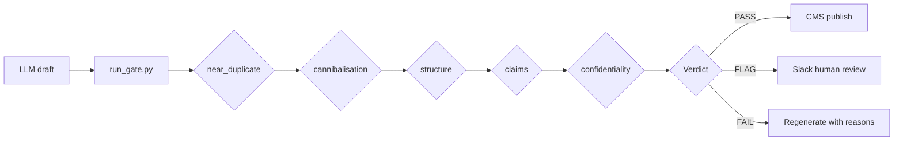
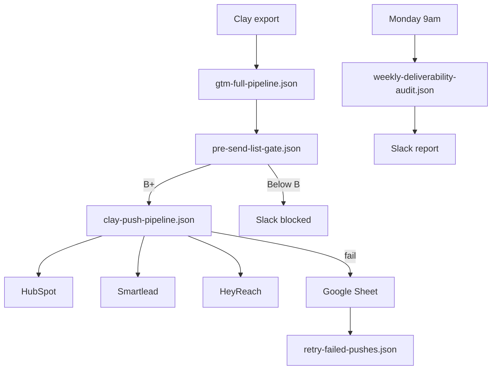

# GTM Signal-to-Pipeline - End-to-End Architecture

> Rasul Shaikh · AI GTM Engineer · 2026
> Live portfolio: https://rasulshaikh.github.io/gtm-portfolio/

---

## Overview

Two signal paths converge into one send pipeline, with QA gates before and after outbound, and a compounding content loop at the end.

**One-line summary:** Signal in → enrich in Clay → score → personalize → list gate (grade B+) → n8n routes to Smartlead/HeyReach/HubSpot → weekly deliverability audit → mine calls for content → loop restarts.

---

## Motion A - Production Omnibound (Clay → n8n → Send)

Scaled outbound for AI search marketing. 60 Clay columns, purple-safety validation, 144 email variants.

| Phase | Columns | What |
|-------|---------|------|
| Intel | 7-13 | Competitor, buyer, category, capabilities |
| Citation | 14-26 | Live AI search proof |
| News | 27-33 | Recent signal for PS lines |
| Email | 34-40 | 4-provider waterfall + ZeroBounce |
| Context | 41-47 | Personalized openers + PS routing |
| Routing | 48-50 | Tier + inbox assignment |
| Persona | 51 | executive / director / general |
| Copy | 52-59 | Hash-seeded variants (144 for e1 alone) |
| Validation | 60 | 12-check PASS/FAIL gate |

**Purple safety (3 layers):**
1. Extraction filters - `"purple"` sentinel → empty string
2. Copy guards - missing field → entire column returns `""`
3. Validator - export only `validator = PASS`

Repo: [gtm-omnibound-clay-workflow](https://github.com/rasulshaikh/gtm-omnibound-clay-workflow)

---

## Motion B - Founder-Led Loop (content → warm outbound)

Content is the signal source. Engagers get warm copy referencing their specific interaction.

| Tier | Score | Play |
|------|-------|------|
| Hot | 80+ | Founder sends personally within 24h |
| Warm | 50-79 | Email sequence + LinkedIn DM |
| Nurture | <50 | Content retarget only |

Repo: [gtm-founder-led-loop](https://github.com/rasulshaikh/gtm-founder-led-loop)

---

## Motion C - Cold Cadence Path (signal-triggered)

23 cadences across signal, persona, vertical, and stage triggers.

| Category | Count | Examples |
|----------|-------|---------|
| Signal | 8 | Series A, hiring SDRs, tech stack change |
| Persona | 7 | VP Sales, CRO, RevOps, Founder |
| Vertical | 4 | B2B SaaS, Fintech, Cybersecurity |
| Stage | 4 | Re-engagement, breakup, post-demo |

Repo: [gtm-email-cadences](https://github.com/rasulshaikh/gtm-email-cadences)

---

## Motion D - NeevCloud Content Gate (volume-safe publishing)

High-volume content pipeline (80 posts/week target) with a six-check gate before CMS. Nothing publishes without PASS or human-approved FLAG.

| Check | Catches | Verdict on hit |
|-------|---------|----------------|
| near_duplicate | Cosine similarity vs published corpus | FAIL >= 0.55, FLAG >= 0.40 |
| cannibalisation | URL competing for owned cluster | FAIL / FLAG |
| structure | Thin content, missing H2s | FAIL / FLAG |
| readability | Dense prose (FK grade) | FLAG |
| claims | Numeric claims without [S#] marker | FAIL > 2, FLAG >= 1 |
| confidentiality | Codenames, unreleased pricing | FAIL (zero tolerance) |

Repo: [gtm-neevcloud-content-gate](https://github.com/rasulshaikh/gtm-neevcloud-content-gate)

---

## n8n Orchestration Layer

Six importable workflows. Import in this order:

| # | Workflow | Repo | Trigger |
|---|----------|------|---------|
| 1 | Pre-Send List Gate | gtm-list-quality-scorecard | Webhook |
| 2 | Clay Push Pipeline | gtm-omnibound-clay-workflow | Webhook + HMAC |
| 3 | Retry Failed Pushes | gtm-omnibound-clay-workflow | Cron 30min |
| 4 | Weekly Deliverability Audit | gtm-deliverability-audit | Cron Monday |
| 5 | Full Pipeline (orchestrator) | gtm-portfolio | Webhook |
| 6 | Content Gate | gtm-neevcloud-content-gate | Webhook |

**Env vars:** `SMARTLEAD_API_KEY`, `HEYREACH_API_KEY`, `N8N_WEBHOOK_SECRET`, `SLACK_GTM_CHANNEL`, `CMS_PUBLISH_WEBHOOK_URL`, `SLACK_CONTENT_CHANNEL`

---

## All 9 Repos

| Repo | Layer | Role |
|------|-------|------|
| [gtm-portfolio](https://github.com/rasulshaikh/gtm-portfolio) | Hub | Site, PDFs, JSON exports, master n8n |
| [gtm-omnibound-clay-workflow](https://github.com/rasulshaikh/gtm-omnibound-clay-workflow) | Intel + Copy | 60-col Clay, purple-safety, push n8n |
| [gtm-email-cadences](https://github.com/rasulshaikh/gtm-email-cadences) | Copy | 23 cadences, MiniMax hooks |
| [gtm-founder-led-loop](https://github.com/rasulshaikh/gtm-founder-led-loop) | Signal + Warm | 4-phase content loop |
| [gtm-ai-lead-scorer](https://github.com/rasulshaikh/gtm-ai-lead-scorer) | Score | 0-100 via Claude Haiku |
| [gtm-clay-formula-library](https://github.com/rasulshaikh/gtm-clay-formula-library) | Copy | 6 reusable Clay IIFEs |
| [gtm-list-quality-scorecard](https://github.com/rasulshaikh/gtm-list-quality-scorecard) | Pre-send QA | Grade A+→F, n8n gate |
| [gtm-deliverability-audit](https://github.com/rasulshaikh/gtm-deliverability-audit) | Post-send QA | DNS + 1% rule, weekly n8n |
| [gtm-neevcloud-content-gate](https://github.com/rasulshaikh/gtm-neevcloud-content-gate) | Content QA | 6-check gate, PASS/FLAG/FAIL, n8n |

---

## Copy Engine Map

| Copy type | Location | AI engine |
|-----------|----------|-----------|
| Production sequences | Omnibound cols 52-59 | Claygent + Clayscript |
| Signal cadences (23) | gtm-email-cadences/cadences/ | MiniMax-Text-01 |
| Warm engager emails | founder-led-loop/03_outbound.py | MiniMax-Text-01 |
| Single-lead emails | gtm-cold-email-personalizer/ | Claude + Playwright |
| Lead scoring | gtm-ai-lead-scorer/ | Claude Haiku |
| Clay formulas | gtm-clay-formula-library/formulas/ | Claygent |
| Content gate copy QA | gtm-neevcloud-content-gate/ | Rule-based + TF-IDF |

---

## QA Gates

### Pre-send (before Smartlead upload)

**gtm-list-quality-scorecard** - 8 dimensions, weighted grade A+ to F.

| Dimension | Rule |
|-----------|------|
| Email verification | 100% verified before send |
| Duplicate emails | <1% acceptable |
| Duplicate domains | 1-2 leads per domain ideal |
| Title relevance | ≥80% match ICP titles |
| Bad-title detection | <2% intern/assistant/coordinator |
| Catch-all density | <5% info@/contact@ |
| ICP fit | ≥80% industry + headcount match |
| Name quality | ≥95% real names |

**Gate:** Grade B+ (80+) required. n8n blocks below that.

### Content (before CMS publish)

**gtm-neevcloud-content-gate** - 6 checks, verdict aggregation.

- Any FAIL fails the post and routes back to generation with reasons
- Any FLAG routes to human review via Slack
- All PASS goes to publish queue (with sampled human audit)

### Post-send (weekly hygiene)

**gtm-deliverability-audit** - the 1% rule.

- SPF / DKIM / DMARC per sending domain
- Inbox fleet health (warmup, SMTP/IMAP, blocks)
- Campaign reply rate - flag if <1% after 200+ sends
- Bounce rate - flag if >3%

---

## Artifacts & Downloads

| File | URL |
|------|-----|
| Architecture PDF | /docs/architecture.pdf |
| Pipeline overview PDF | /docs/gtm-pipeline-overview.pdf |
| GTM profile PDF | /profile/gtm-profile.pdf |
| GTM profile JSON | /profile/gtm-profile.json |
| Workflow JSON | /profile/workflow.json |
| n8n full pipeline | /n8n/gtm-full-pipeline.json |

Regenerate PDFs: `python3 tools/generate_play_pdfs.py && python3 tools/generate_architecture_pdf.py`

---

## Tech Stack

| Layer | Tools |
|-------|-------|
| AI / LLM | Claude Code, Anthropic API, OpenAI, MiniMax Text-01, MCPs, Modal, Python |
| Outbound | Clay, Smartlead, Instantly, Apollo, HeyReach, Trigify, Zapmail |
| Enrichment | Playwright, Firecrawl, PhantomBuster, Prospeo, Apify, Deepline |
| CRM / RevOps | HubSpot, Salesforce, Attio, Supabase |
| Automation | n8n, Webhooks, REST APIs, Dynadot |